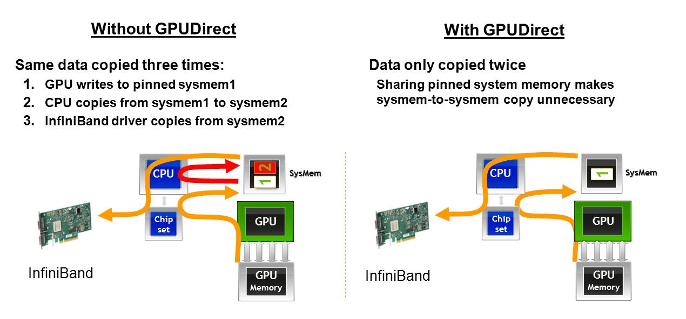
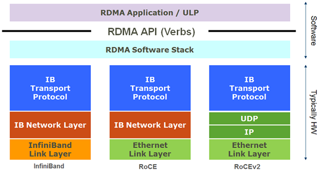

# **DL行业认知**       
声明：本文主要涉及深度学习方面
# 工程方面
总体感觉，AI的发展离不开优秀算法，但更离不开工程的支持。模型的实现，训练，部署，平台管理，以及多结构输入都涉及到很多的工程问题。    
下面从这几个问题一一介绍。

## 模型实现
主要在于DL（深度学习）框架的选择，一般来说首选TensorFlow，但是很多人也喜欢Pytorch的动态图形和更舒服的API。TensorFlow也支持动态图形了。

## 模型训练
模型的训练很重要，重要的地方在于要数据吞吐大，loss收敛快。这样便于迭代更新模型。    
这是Andrew Ng在课程上的图片，主要含义就是，深度学习的模型是一个“想法-实现-实验”的循环，从中你可以看到，如果实现时间太长，会导致你无法实现更多想法。    
人们嘲笑深度学习算法从业者为调参师，这是因为每个深度学习模型需要人为设置很多参数，如果训练够快，你可以尝试更多参数组合，也就意味着你有更大概率找到最好的模型和参数组合。    
从实际产品上看，如果模型训练速度快，那么产品迭代周期也会快。    
提高训练速度的方法    
主要通过分布式训练提高，但是对于强化学习这块则需要其他方案，例如伯克利的 Ray 。    
[科普：分布式深度学习系统（一）](https://zhuanlan.zhihu.com/p/29032307)    
[科普：分布式深度学习系统（二）](https://zhuanlan.zhihu.com/p/30976469)

### 数据并行
目前主流的方法，我觉得是数据并行方式，参见《 Accurate, Large Minibatch SGD: Training ImageNet in 1 Hour 》，以及具体实现 Uber 的 [Hovorod](https://github.com/uber/horovod)。主要的思路就是，多个机器一同训练，但是每次迭代需要同步梯度。
但在具体实现方式上，Hovorod 避免了复杂的 TensorFlow 分布式书写（很多人诟病）。

### 加快分布式训练
分布式训练的瓶颈在于通信。TensorFlow 自带的分布式通信方式是 PS 。目前更好的通信方式是 ring-all-reduce 。    
要想提高分布式训练速度，就要努力提高 计算/通信比。
### 如何加快通信？
硬件驱动部分：使用 RDMA 、 GpuDirect （ GDR )、Nvlink等，提高通信速度，取代 TCP 。    
模型软件部分：梯度压缩，矩阵分解，通信计算overlap等。    

[如何理解Nvidia英伟达的Multi-GPU多卡通信框架NCCL](https://www.zhihu.com/question/63219175/answer/206697974)    
[TensorFlow分布式训练加速之梯度压缩](https://zhuanlan.zhihu.com/p/32016451)    
[TensorFlow分布式训练：任意比例压缩通信时间](https://weibo.com/ttarticle/p/show?id=2309404198999161722650)    
### AI 分布式框架
另外，伯克利大学开发了 [Ray](https://github.com/ray-project/ray) 。目的是想开发一个试用 AI 的分布式框架。其中亮点在于项目内嵌了强化学习的分布式实现。强化学习一般很难分布式的，是无数据训练。

## 模型部署
训练好的模型总要部署到线上，但是部署在 server 后端，还是移动终端是一个选择问题，但是需求都强烈。    
TensorFlow lite 正在解决模型部署到移动端的问题。    
TensorFlow Serving 在解决模型部署 server 后端的问题。    
部署的问题主要在于性能问题，如果部署在移动终端还有模型文件的大小问题。    
[TensorFlow模型压缩和Inference加速](https://zhuanlan.zhihu.com/p/31023153)

### Inference加速
主要是深度学习模型的计算力需求太大了，尤其是 CNN 。一般来说计算力主要来自 CNN 。    
”Inference加速的手段有parameter quantization（如BinaryNet），Low-rank approximation，filter-level pruning。filter-level pruning有很多优点，通过裁剪整个filter，不该变原来的网络架构，也不需要额外的DL库支持，并且能减少内存占用，并且能和parameter quantization，Low-rank approximation并用。最近看到2篇filter level pruning的论文，来自Megvii的[2]，来自南京大学的lamda实验室[3]。    
[2]和[3]的方法非常类似，都是把每一层卷积看作线性变换，用特征选择方法，裁剪channel。其中[2]使用LASSO做特征选择，[3]使用贪婪算法。“    
   
最近，Uber提出SBNet 。    
[利用激活的稀疏性加速卷积网络](https://mp.weixin.qq.com/s?__biz=MzA3MzI4MjgzMw==&mid=2650736316&idx=4&sn=5aed5223f389a50bec0971bb2f189669&chksm=871ac2c2b06d4bd42c53ad3aa09d6409df21399fb2e0ea480f37c4be392918fd340634fd9942#rd)

### 模型裁剪
主要是深度学习模型的参数太多，尤其是 FNN 。一般来说参数主要来自 FNN （全连接）。    
”Pruning是模型压缩的常用手段，通过设置一个threshold，通过剪枝权重低于threshold的连接，并通过fine-tuning减少精度损失。这样得到一个非常稀疏的模型。    
另一种手段是替换全连接层。最新的网络如GoogLeNet和ResNet已经不使用全连接层，取而代之的是global average pooling层。我们参照[3]对VGG 16使用global average pooling层替换全连接层，并使用10个epoch finetune，模型参数压缩为原来的十分之一，分类精度并未下降。“ 

## 深度学习平台
目前各个公司都在开发部署自己的深度学习平台，因为深度学习对于计算力的需求很强。公司内部有统一的平台能够提高资源利用度（GPU 很贵的），镜像管理（大大减少运维部署），模型统一管理，数据特征提取与存储等。    
国内的方案有两种：一种基于 Yarn，一种使用 k8s。几乎都选择 k8s 。    
但是就针对机器学习平台来讲，Uber 的米开朗琪罗系统是做的最好的。
除了上面提到的各种功能，米开朗琪罗能做到线上线下数据打通，并实时训练迭代自己的模型，有相应的论文。[Uber blog](https://eng.uber.com/michelangelo/)

## 多结构输入
不管使用的是静态框架还是动态框架，我们实际上都只用到了构建静态实体计算图的能力。为什么这样说呢？因为在一般在将数据投入模型进行训练或预测之前，往往会有一个预处理的步奏。在预处理的时候，我们会将图片缩放裁剪，将句子拼接截断，使他们变为同样的形状大小，然后将集成一个个批次（min-batch），等待批次训练或预测。这些不同的输入到模型中其实运行的是同一个实体计算图。    
然而，并不是所有项目的数据都可以预处理成相同的形状和尺寸。例如自然语言处理中的语法解析树，源代码中的抽象语法树，以及网页中的DOM树等，形状的不同本身就是非常重要的特征，不可剥离。     
这样一来，对于每一个样例，我们都需要一个新的计算图，这种问题我们需要使用构建动态计算图的能力才能够解决。这种问题我们可以叫它多结构输入问题。    
[以静制动的TensorFlow Fold](https://zhuanlan.zhihu.com/p/25216368)

## 模型解释
深度学习训练出的模型都市“黑箱”，即没有可解释性。虽然我们应该对模型更有信心，不需要完全理解、甚至也无法完全理解模型，但是能对模型做出某种程度的解释也是大有裨益的。    
能从模型中学到经验知识。倘若发现“黑箱”的奥秘，我们就可以移花接木的运用了。    
能帮助修改模型。如果发现“黑箱”使用了错误的经验知识，那么我们可以调整模型，让模型避免误区。